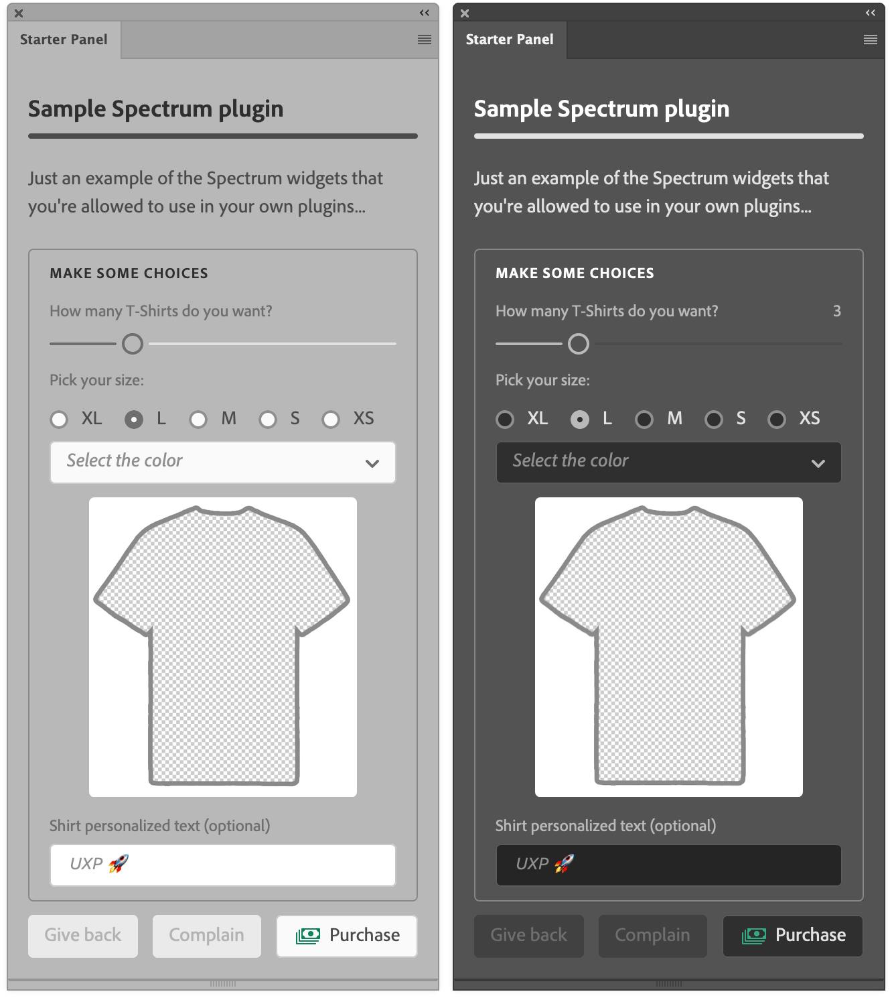

# Sample Spectrum T-Shirts plugin

From the UXP Developer Tool `ps-starter` template. It demoes a small selection of Spectrum Widgets, Themed media queries and UI data collection.

Refer to [this blogpost](https://www.davidebarranca.com/development/Adobe-UXP-things-you-need-to-know-9-Adobe-Spectrum-UXP.html) and [video](https://youtu.be/j58FvGYNPnE).