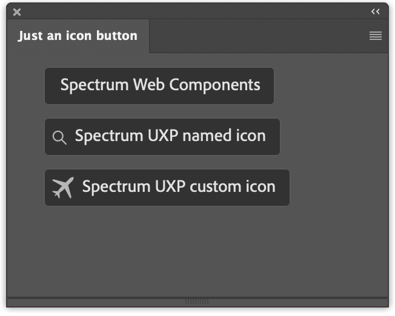

# Just an icon button

From the UXP Developer Tool `ps-starter` template. It demoes how to (and how not to) use Spectrum Icons in Action Buttons.

Refer to [this blogpost](https://www.davidebarranca.com/development/Adobe-UXP-things-you-need-to-know-9-Adobe-Spectrum-UXP.html) and [video](https://youtu.be/j58FvGYNPnE).